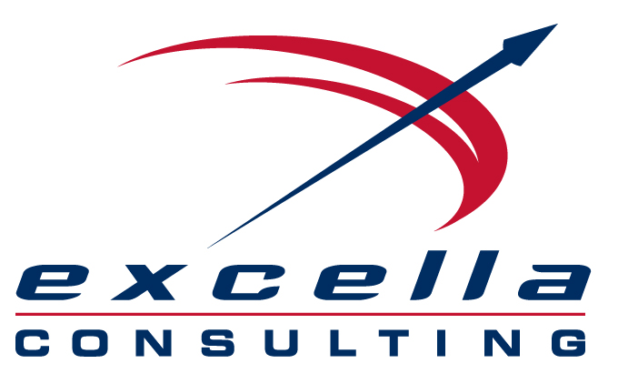

# [.NET Tech Radar, Summer 2017](http://radar.excellalabs.com/?sheetId=https%3A%2F%2Fdocs.google.com%2Fspreadsheets%2Fd%2F1nodW2q6Is-A-Cw7h7d3drneVHuRMP-zhPYEU0o1_Qqg)

Excella .NET engineers have developed a Tech Radar to help make sense of the fast-changing .NET world. A Tech Radar paints the  landscape of an ecosystem, to provide you with awareness about important new or changing technologies and what you should do with them.

We developed the .NET Tech Radar using knowledge gained through our experience and advice from thought leaders in the community. We're passionate about .NET and are excited about the vast changes taking place. Therefore, we are trying to do our part to help make sense of it all.

We've taken influence and tooling from the [Thoughtworks Radar](https://www.thoughtworks.com/radar/faq), which has been an invaluable resource to the tech community. You can view the radar now via the link at the bottom of the page, but before that, there is a deeper explanation of how the radar works, as well as major themes from the radar. 

## Radar details

The tech radar includes the technologies that we deem critical for .NET experts to be aware of. Usually, it's either new technology that is important enough to look into, or existing technology that is newly relevant or still relevant in the face of new competitors or other major changes. It also includes technology that should absolutely be a consideration for any project.

*Quadrant topics* are just a course way to break things into categories, and we're using the same ones as you'll see in the Thoughtworks Radar.

The *ratings*:

- The **Adopt Ring** represents items that we think you should be using now. It's not that it has to be used on every project everywhere, but it's proven and mature for use and often a clear top choice.

- The **Trial Ring** are for things we think are ready for use, but not as completely proven as those in the adopt ring. So for most organizations we think you should use these on a trial basis, to decide whether they should be part of your toolkit. Typically, we are open to trying these items but understand that many organizations will be cautious.

- The **Assess Ring** are things that you should look at closely, but not necessarily trial yet - unless you think they would be a particularly good fit for you. Typically these are items we are currently trialing in our own side projects to gain experience and prove them out.

- The **Hold Ring** is for things that are getting attention in the industry but we don't think are ready for use, they should not be used, or should be actively be phased out. Sometimes this is because we don't think they are mature enough yet, sometimes it means we think they are irredeemably flawed. We don't have an "avoid" ring, but we do throw things in the hold ring that have enough attention that we don't think our clients should use, or things that we want to highlight as no longer being good picks based on changes in the ecosystem.

## Radar Themes

These are the overarching themes we identified in developing the radar.

1. .NET Core

    One theme of this radar is that .NET Core is looking more like the clear future for Microsoft's general development landscape, and the 2.0 release may be considered the real version 1.0, so it's definitely something to consider in your future solution strategies. It is certainly a major change that brings in a lot of APIs whose absence were causing people to struggle to make the switch.

    Even if you aren't a .NET shop, you can now consider .NET Core as a performant, cloud-optimized platform for anything from small websites, background services to microservices. It is considered production-ready, and you should have or start a roadmap for how you'll work it into your organization, typically via small, lower risk projects to test it and gain experience.

    Deployment options are much greater than with IIS. Being cross-platform, Linux and container-based deployments are possible and quite workable. It can fit in seamlessly with other technologies such as Node.js, Go as far as deployment and workflow.

    .NET Core development on MacOS or Linux is a perfectly reasonable possibility and works well. Visual Studio Code has established itself as a top IDE for a wide range of languages, and Visual Studio 2017 has made some great performance improvements and should be sought if your shop is using VS.

1. Containers

    Microsoft has realized how important containers are and have made them a main focus now, not just with the new Windows Containers, but with the full the container landscape - from .NET Core being able to run in Linux containers and be deployed anywhere along with traditionally Linux-only packages, to any app on any platform in a container being deployable in a variety of ways in Azure.

1. Azure

    Azure is another key focus in the Microsoft ecosystem, which we should continue to see fast growth and matching of AWS capabilities. Cosmos is an interesting addition in a flexible, horizontally scalable NoSQL data store. There is a lot of focus on containers here too, with Docker for Azure making it easy to deploy container-based apps, and Azure Container Service that supports third-party orchestrators such as Kubernetes and Swarm. 

    The future is quite dynamic right now in the .NET world, which is very exciting since many of the changes seem to be going in the right direction.

## > [View the Radar](http://radar.excellalabs.com/?sheetId=https%3A%2F%2Fdocs.google.com%2Fspreadsheets%2Fd%2F1nodW2q6Is-A-Cw7h7d3drneVHuRMP-zhPYEU0o1_Qqg)

